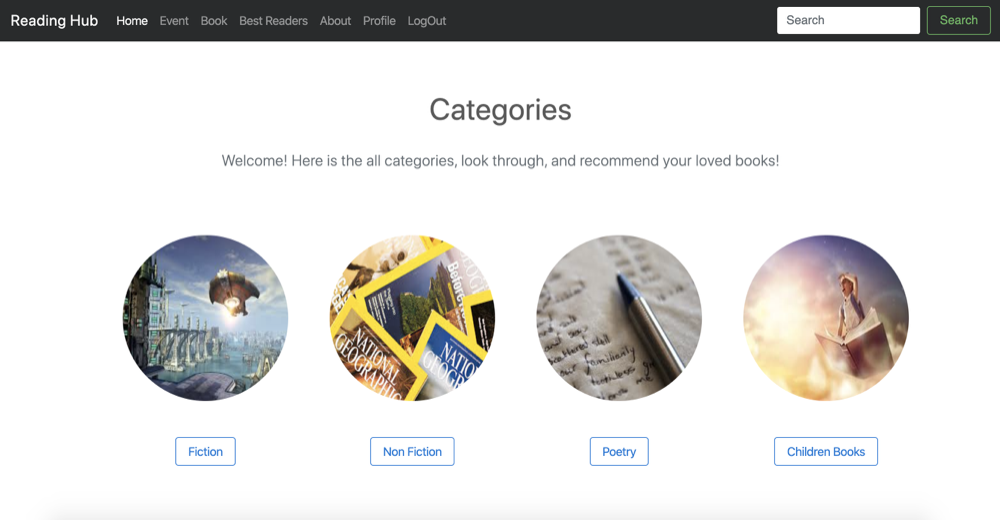
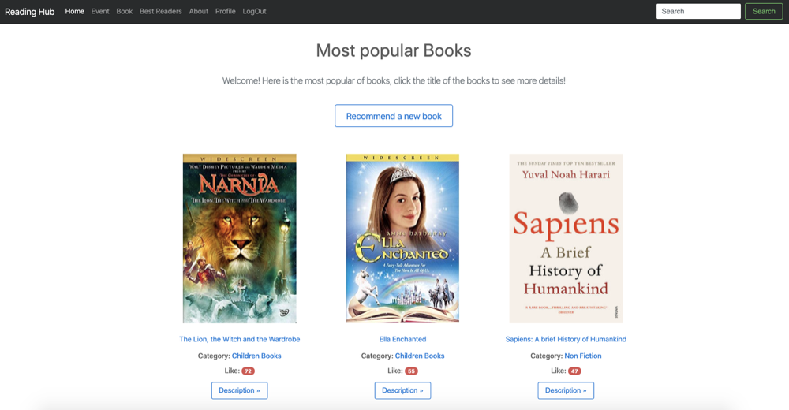
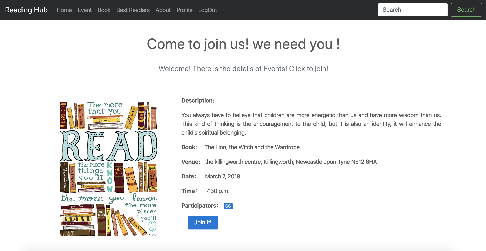

# Welcome to ReadingHub!
Set up an virtual environment:

```bash
conda create -n readinghub python=3.7.1
conda activate readinghub
pip install -r requirements.txt
```

Runserver:

```bash
python manage.py migrate
python populate_readinghub.py
python manage.py runserver
```

## Some ScreenShot For Readinghub:

**Category**: where you can have a overview of the books on our websites.



**Book**: in each category page, you can see the descriptions of each books. Click the name or the image of the books, the you will be redirected to the detailed page of the book, all information of it is in front of you.



**Event**: in front of the home page, there are at least three latest events are shown like a slide. Click one which you are interested in, you will see all information of the event and you can decide if you wanna join it. Precondition is that you are already registered.



## A presentation video for Readinghub:

 [Presentation Video](https://youtu.be/NXFdqh3Qg6E)

## Notes and upgrated logs:

 [notes](notes.md)